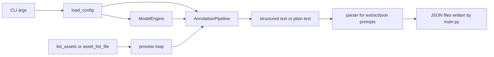

# 架构深度解析 (Architecture Deep Dive)

本文档对应当前代码，而不是早期设想版。主线实现是一条清晰的单资产流水线，再加上面向批量任务的资产枚举与分块控制。

## 1. 核心设计理念

- **模块分层**：CLI、配置、模型、流水线、文件工具分开维护
- **配置驱动**：大部分运行参数来自 `config/config.yaml`
- **解析前置**：结构化结果先以文本形式生成，再由代码解析和规范化
- **批量可扩展**：通过 chunking 把大规模任务拆到多 worker

## 2. 当前数据流

## 3. 关键模块

### 3.1 `main.py`

职责：

- 解析命令行参数
- 读取并覆盖配置
- 初始化 `ModelEngine` 与 `AnnotationPipeline`
- 枚举资产
- 执行 chunking
- 根据重试规则决定是否跳过已有输出
- 将结果写入 `{output_dir}/{asset_name}_annotation.json`

`asset_name` 本身通常是 `category/asset_id` 这样的相对路径，所以输出自然保留了分类目录层级。

### 3.2 `core/pipeline.py`

`AnnotationPipeline.process_asset()` 的真实步骤是：

1. 调 `get_asset_images()` 找图
2. 用 `PromptFactory.compose_user_prompt()` 生成 prompt
3. 通过 `_prepare_messages()` 拼出多模态消息
4. 调 `ModelEngine.inference()` 获取文本结果
5. 如果 prompt 名里含 `extract` 或 `json`，走 `parse_structured_text_enhanced()`
6. 成功后覆盖 `category`、规范化 `dimensions` / `mass`
7. 失败则返回 `raw_output`

这里最容易被误写错的一点是：**主线不是 JSON 清洗器，而是 structured-text parser。**

### 3.3 `core/model.py`

当前实现会在模型名包含 `Qwen3` 时优先尝试 `Qwen3VLMoeForConditionalGeneration`，随后再尝试 `Qwen2_5_VLForConditionalGeneration`、`AutoModelForCausalLM`，最后才是 `AutoModel`。

推理时依赖：

- `AutoProcessor.apply_chat_template()`
- `qwen_vl_utils.process_vision_info()`
- `model.generate()`

这说明现有实现最贴近 Qwen 系列多模态接口。

### 3.4 `core/prompt.py`

这里维护 prompt 类型注册表和具体模板。`extract_object_attributes_prompt` 明确要求模型输出带字段头的结构化文本，而不是 JSON 代码块。

### 3.5 `utils/file.py`

- `list_assets()` 递归查找包含图片的目录，并在命中后停止继续向下遍历该分支
- `get_asset_images()` 先尝试命名视角，再回退到全部图片

## 4. 容错与重试

当前运行时容错并不复杂，但非常实用：

- 已有成功 JSON：默认跳过
- `raw_output` 文件：自动重试
- `--retry_incomplete`：只重试字段不完整的资产
- `--force`：无条件重跑

这种设计直接支撑了历史上的大规模修复与补跑流程。

## 5. 生产结果如何反证架构可行

当前仓库状态记录显示：

- 52,907 个资产已完成标注
- `raw_output` 失败已清零
- 五个主字段完整率都是 100%

所以这套架构不是“理论上可扩展”，而是已经用来完成过一次大规模交付。
