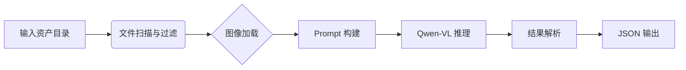

# 项目概览

**Auto-Asset-Annotator** 是一个基于多模态大语言模型（Multimodal Large Language Models, MLLMs）的自动化 3D 资产标注工具。本项目旨在通过智能化的视觉理解能力，批量处理大规模 3D 资产库，自动生成详细的属性描述、分类标签、QA 问答对以及特定场景的 Referring Expression。

## 核心价值

*   **自动化批量处理**：解决人工标注效率低、成本高的问题，支持百万级资产的并行处理。
*   **多维度信息提取**：不仅限于简单的分类，还能提取材质、尺寸、功能、状态等深层属性。
*   **灵活的视图支持**：支持任意视角的渲染图输入，通过多视图融合（Multi-view）技术提升识别准确率。
*   **标准化输出**：生成结构化的 JSON 数据，易于集成到下游任务（如资产检索、场景生成）中。

## 架构设计

项目采用模块化设计，主要包含以下核心组件：

### 1. 数据层 (Data Layer)
*   **资产发现 (`utils/file.py`)**：自动扫描指定目录，支持自定义的视图命名规则（如 `front.png`, `left.png` 或 `0.png`, `1.png`）。
*   **图像预处理 (`utils/image.py`)**：负责图像的加载、校验以及多视图拼接（Concatenation）。

### 2. 核心逻辑层 (Core Layer)
*   **Prompt 工厂 (`core/prompt.py`)**：管理各种标注任务的提示词模板。支持的任务类型包括：
    *   `extract_object_attributes_prompt`: 提取详细属性（JSON 格式）。
    *   `classify_object_category_prompt`: 物品分类。
    *   `describe_object_prompt_MMScan`: 生成详细自然语言描述。
    *   `find_canonical_front_view_prompt`: 寻找最佳正视图。
*   **模型引擎 (`core/model.py`)**：封装底层 VLM（如 Qwen-VL），处理 GPU 显存管理、模型加载和推理参数（Temperature, Top-P 等）。
*   **标注流水线 (`core/pipeline.py`)**：串联数据加载、Prompt 构建、模型推理和结果解析的全流程。

### 3. 接口层 (Interface Layer)
*   **配置管理 (`config/`)**：基于 YAML 的声明式配置，解耦代码与运行参数。
*   **命令行工具 (`main.py`)**：提供丰富的 CLI 参数，支持单机运行和分布式集群作业提交。

## 工作流程图

